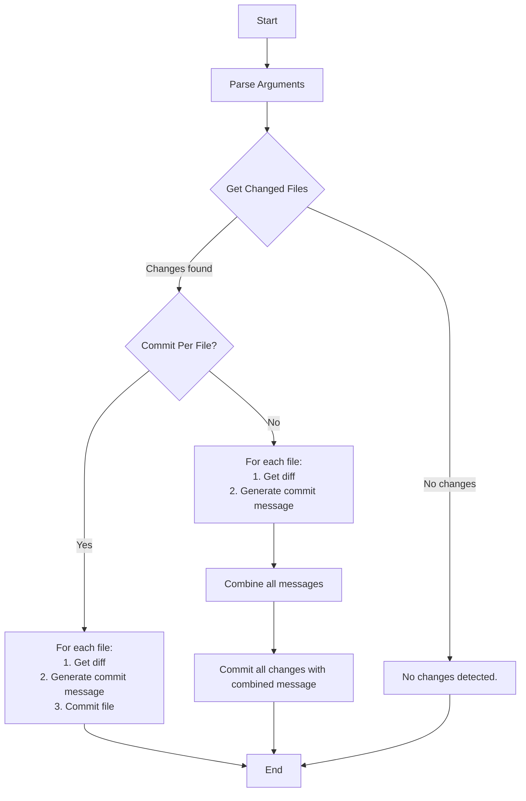

### Overview

`auto_commit.py` is a Python script that automates the process of generating concise, conventional commit messages for your Git repository changes using an LLM (via Ollama). It can commit all changes at once or commit each file separately, with AI-generated commit messages based on the actual diffs.


### Features

- AI-generated commit messages: Uses an LLM to analyze Git diffs and suggest relevant, conventional commit messages (e.g., feat:, fix:, chore:).
- Commit all or per file: Optionally commits all changes together or each file separately, each with its own message.
- Handles new, modified, and deleted files.
- Works with both staged and unstaged changes.

### How It Works

1. Detects changed files (staged and unstaged).
2. Gets diffs for each file.
3. Sends diffs and file info to the LLM via Ollama to generate a commit message.
4. Commits changes using the generated message(s).




### Installation

- Python 3.7+

- [Olama](https://ollama.com/download)

- [Ollama Model](https://ollama.com/library/gemma3)

This script currently uses the `gemma3:4b` model.

```
ollama run gemma3:4b
```

- [Ollama Python client](https://github.com/ollama/ollama-python) 
```
pip install ollama
```

- Git installed and available in PATH

### Usage

If ollama server is running, run the script using the command

```
python auto_commit.py <repository_path> [single]
```

- <repository_path>: Path to your Git repository.
- single (optional): If provided, commits each file separately; otherwise, all changes are committed together.

### Example

Commit all changes in git:

```
python3 auto_commit.py /Users/ttpho/Documents/GitHub/chat
```

Commit each file separately:

```
python3 auto_commit.py /Users/ttpho/Documents/GitHub/chat single
```

### Notes

- The script uses the `gemma3:4b` model by default. You can change the model by editing the model variable.
- Commit messages are limited to 72 characters and follow the [Conventional Commits](https://www.conventionalcommits.org/en/v1.0.0/) style.
- The script will print the generated commit messages before committing.

### Miscellaneous

Contributions and ideas are welcome, such as:

- Modifying the prompt, model, or LLM provider.

- Generating commit messages for individual files or a single message for all files.

- Optimize or refactor...
